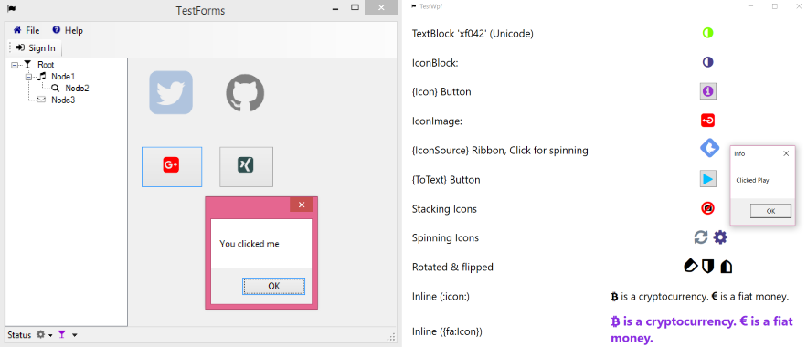

# FontAwesome.Sharp

A library for embbeding [Font Awesome](http://fortawesome.github.io/Font-Awesome/) icons in WPF applications via [NuGet](http://www.nuget.org/). Inspired by [ioachim/fontawesome.wpf (BitBucket)](https://bitbucket.org/ioachim/fontawesome.wpf) and [Using Font Icons (CodeProject)](http://www.codeproject.com/Tips/634540/Using-Font-Icons).

Here is a screenshot from the sample application

## Installation

Add the NuGet package to your WPF application or library. From the Package Manager Console type

	Install-Package FontAwesome.Sharp 

## How to use

You can add iconic items to your views in the following ways

### Inline Text

The most rudimentary way is to use *FontAwesome* directly with a `TextBlock` like

        <TextBlock Grid.Column="1" Text="&#xf042;" 
			FontFamily="/FontAwesome.WPF;component/fonts/#FontAwesome"
			Foreground="Chartreuse" 
			TextAlignment="Center" />

However, you need to have the [FontAwesome Cheatsheet](http://fortawesome.github.io/Font-Awesome/cheatsheet/) on your knees to know the icons correct unicodes.

#### `<fa:IconBlock />`

To use *FontAwesome*-icons in text you can use the `IconBlock` which subclasses the standard WPF [TextBlock](http://msdn.microsoft.com/en-us/library/system.windows.controls.textblock.aspx). You can the set the corresponding *Font Awesome* icon via the `Icon`-property:
		
	<fa:IconBlock Icon="Home" Foreground="Blue" /> 

### Buttons

The most typical use case for icons is buttons. Of course you can use `IconBlock` with element-style syntax:

    <Button>
        <Button.Content>
            <fa:IconBlock Icon="Info" Foreground="Chocolate"/>
        </Button.Content>
    </Button>

However, this is awfully long code for just having an icon.

#### `{fa:Icon [Icon]}`

the `Icon` markup extension allows for a shorthand notation to create an `IconBlock` using the attribute syntax:

    <Button Content="{fa:Icon InfoCircle, Foreground=Chocolate}"/>

#### `{fa:ToText [Icon]}`

Using the `ToText` markup extension is most recommended when using the font. It translates an `IconChar` to a `string` capturing the icon´s unicode. Here is an example

    <Button Content="{fa:ToText Play}" />

And here a default style

	

### Images

#### `<fa:IconImage />`
Use this control when you are restricted to images and cannot you `IconBlock`. It subclasses the standard WPF [Image](http://msdn.microsoft.com/en-us/library/system.windows.controls.image(v=vs.110).aspx) for convenience. Again, you can set the corresponding Font Awesome element via the `Icon`-property like this
		
        <fa:IconImage Icon="Ambulance" Foreground="Red" Width="24" Height="24"/>
You can additionally change the color with the `Foreground`-property.

### ImageSource (RibbonButton)

#### `{fa:IconSource [Icon]}`
When you are restricted to [ImageSource](http://msdn.microsoft.com/en-us/library/system.windows.media.imagesource(v=vs.110).aspx) like with the WPF [Ribbon](http://msdn.microsoft.com/en-us/library/ff799534(v=vs.110).aspx) control you can use the `IconSource` markup extension like:

        <RibbonButton SmallImageSource="{fa:IconSource InfoCircle, Foreground=Red"/>

### Menus and MVVM

For `MenuItem` you want to set the `Icon` property via an `<fa:IconImage />`. However, in MVVM scenarios you want to bind the icon of a view-model to the menu item. This can be done with the `IconToImageConverter` like this

    <Window.Resources>
        <fa:IconToImageConverter x:Key="IconToImage"/>
    </Window.Resources>
    <Window.ContextMenu>
        <ContextMenu>
            <MenuItem Command="Open" Icon="{Binding Icon, Converter={StaticResource IconToImage}}"/>
        </ContextMenu>
    </Window.ContextMenu>
 
where the view model looks like this

    public class MainViewModel
    {
        public IconChar Icon { get; set; }
    }

and the window `DataContext` is initialized for instance like this

    public partial class MainWindow
    {
        public MainWindow()
        {
            InitializeComponent();

            DataContext = new MainViewModel {Icon = IconChar.Apple};
        }
    }

#### Styling the converted menu images

Often you want to have the menu icons all have a consistent style (e.g. size and foreground). To achieve this you can configure the `IconToImageConverter` like this

    <Brush x:Key="FaBrush">DarkOrchid</Brush>
    
    <fa:IconToImageConverter x:Key="IconToImage" 
		Foreground="{StaticResource FaBrush}" 
		ImageStyle="{StaticResource FaImageStyle}"/>

## Related Projects
Other libraries for using FontAwesome in Windows applications that we know of and are available on NuGet:

- [FontAwesome.Portable](http://www.nuget.org/packages/FontAwesome.Portable/)
Great idea to make it a portable library. However, we could not find the source repository.
- [charri/Font-Awesome-WPF](https://github.com/charri/Font-Awesome-WPF): Clean and nice implementation. Icon metadata and spinning support are really cool. 

In production, however, we needed to support 
	- Ribbons using ImageSource (not only Image), 
	- MVVM with Icon enum (smaller memory footprint on the viewmodel than Image) and 
	- more markup extensions to keep the Xaml compact. 

Another reason this project exists, is we started this about a year ago and recently (March 2015) decided to go open source. Then we found the excellent implementation of [charri/Font-Awesome-WPF](https://github.com/charri/Font-Awesome-WPF). For now, we renamed the project to `FontAwesome.Sharp` to avoid conflicts in the NuGet gallery. On the short-term, maybe we are going to contribute to `charri/Font-Awesome-WPF`.